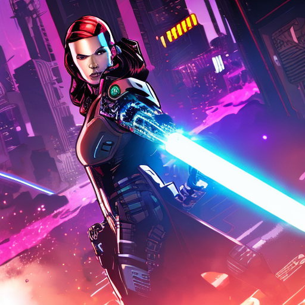
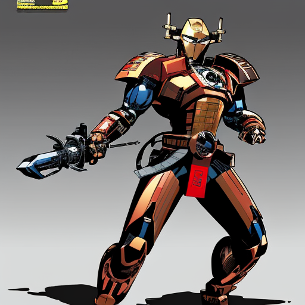

# Generador de Superhéroes

## Desarrolladores

[Pablo García Muñoz](https://www.linkedin.com/in/pablo-garc%C3%ADa-mu%C3%B1oz-a9b2402a9/) y [Hugo Peralta Muñoz](https://github.com/Pykoncio)


Esta aplicación permite generar imágenes de superhéroes utilizando un modelo mediante una interfaz creada con Streamlit. La aplicación se comunica con una API (Stable Diffusion) que genera las imágenes en función de los parámetros especificados.

El modelo usado ha sido: [Comic-Diffusion-v2](https://huggingface.co/ogkalu/Comic-Diffusion/tree/main)

## Características

- Interfaz interactiva creada con Streamlit.
- Permite configurar parámetros como:
  - Prompt y Negative Prompt.
  - Número de pasos ("steps") y CFG Scale.
  - Dimensiones de la imagen (width y height).
  - Selección de sampler (e.g., Euler a, DDIM, PLMS).
- Visualización de un GIF de carga.
- Visualización de la imagen generada.

## Visualización en Acción

Durante la generación de la imagen, se muestra el siguiente GIF como indicador de carga:


## Ejemplos de Imágenes Generadas

A continuación se muestran algunos ejemplos de imágenes generadas por la aplicación:




## Requisitos

- [Docker](https://www.docker.com/) (opcional, para ejecución en contenedor)
- Acceso a la API de generación de imágenes en:  
  `http://host.docker.internal:7860/sdapi/v1/txt2img`
- Python (si se quiere ejecutar localmente sin Docker)

## Instalación

### Ejecución con Docker

1. Abre una terminal y navega al directorio `HeroCreation`.
2. Construye la imagen Docker:
   ```sh
   docker build -t hero_creation .
